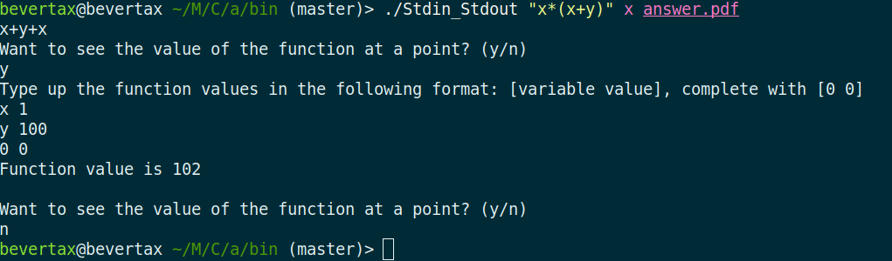

Acronis. Символьный дифференциатор
==================================

    Реализуйте программу, принимающую формулу в традиционной математической нотации,
    с учетом естественного приоритета операций и без лишних скобок,
    и выдающую ее полную производную в виде формулы в PDF-файле
    (с припиской “Утрем нос Стивену Вольфраму!”).

    Должна поддерживаться большая часть элементарных функций и умеренные
    упрощения выражения (умножение на 0 и 1, сложение с 0 и т.п.).
    Оцениваться будет не только решение, но и стиль кода, его архитектура.

    Язык программирования - C++. Все контейнерные структуры данных надо будет
    реализовать самостоятельно, без использования STL.

Описание
--------
 1. В папке src находятся классы Differentiator, Formula и Parser - они   представляют основной механизм решения задачи. Также в src лежат реализованные структуры данных: Tree, List, Vector и UnorderedMap.
 2. Дифференцирование происходит по следующей схеме: создается объект типа Differentiator с единственным публичным методом Differentiate, которому на вход подается строка, содержащая формулу в обычной математической нотации, и имя переменной, по которой происходит дифференцирование. Метод возвращает экземпляр класса Formula, который хранит в себе дерево разбора математического выражения. Formula умеет преобразовывать себя в pdf, выводить в виде строки и подставлять вместо имени переменной ее значение (метод At).
 3. Как именно устроено дифференцирование с точки зрения реализации?
     - после того как дифференциатор принял формулу, он передает ее в виде строки в конструктор класса Formula, который вызывает метод Parse у класса Parser, возвращающий дерево разбора выражения с возможностью итерации в порядке post order dfs.
     - дифференциатор обходит дерево и создает новое на его основе (метод CreateLike), но содержащее уже продифференцированную формулу. Это, видимо, наиболее неэффективное место в программе, потому что строки конкатенируются и поднимаются вверх по дереву, образуя асимптотику за квадрат от длины формулы в худшем случае, хотя остальные части программы работают за линию. Однако это не представляется сильно страшным, поскольку формулы редко когда бывают длиннее сотни символов. Пример рекурсивного подъема по дереву:
     
     - После этого дифференциатор снова создает формулу из полученной строки, чтобы в дальнейшем ее оптимизировать и уметь ходить по дереву производной для преобразования в pdf и подстановки значений. Эту формулу дифференциатор возвращает после оптимизаций.
 4. Как работает парсер?
  Парсер фактически преобразует полученную на вход строку в обратную польскую нотацию, но делает это в виде дерева, а не в виде строки. Это накладывает существенные ограничения, подробнее в разделе "Что дальше?".

Требования
----------
- компилятор, удовлетворяющий требованиям c++17
- cmake версии не ниже 2.8
- пакеты texlive-latex-base, texlive-lang-cyrillic, texlive-lang-cyrillic для вывода в pdf

Как запустить?
--------------
Есть папка stdin_stdout, в которой лежит файл main.cpp. После сборки проекта в папке bin будет находиться исполняемый файл Stdin_Stdout, пример использования которого ниже:

Выражение, имя переменной, по которой происходит дифференцирование, и имя файла(обязательно содержащее .pdf).

Что с тестами?
--------------
Есть папка tests, в которой лежат тесты для дифференциатора и контейнеров. Также настроена система автоматического запуска тестов travis-cl.

Что дальше?
----------
 1. Изменить тип парсинга, сделать это с помощью формальных грамматик. Такое улучшение повысит надежность и качество кода, позволит добавить унарный минус (которого сейчас нет из-за излишней сложности отделения его от бинарного, уж лучше тогда реализовать грамматики, чем убивать код рассмотрением вырожденных случаев (а если захочется еще чего-нибудь интересного, спрашиваю я себя, и прихожу к выводу, что не стоит рассматривать унарный минус)). На данный момент можно написать (x + y), (+ x y), (x y +), и все эти конструкции будут валидны и эквивалентны.
 2. Сделать так, чтобы код не падал от _любой_ ошибки в выражении, а вместо этого сообщал о месте, в котором выражение некорректно. Сейчас же код работает (я очень надеюсь), если вводить правильные выражения, и падает во всех остальных случаях. Зачатки обработки ошибок существуют в виде std::optional. В действительности должно быть достаточно рассмотреть все случаи, когда функции возвращают нулевое значение.
 3. Исправить контейнер UnorderedMap. Во-первых, отрефакторить код, во-вторых, реализовать уменьшение контейнера, когда load factor достигает низких значений (так будет реализовываться линейная сложность итерирования). Сделать контейнеры совместимыми с stl. Сейчас реализованы лишь методы, непосредственно использующиеся в дифференциаторе, и даже эти методы работают не всегда так, как можно ожидать. Но корректное использование контейнеров сейчас соответствует stl (и именно это проверяют тесты), а вот некорректное всегда падает.
 4. Добиться линейной сложности (противоречит пункту 1).

####ps
вообще вроде мило получилось)
